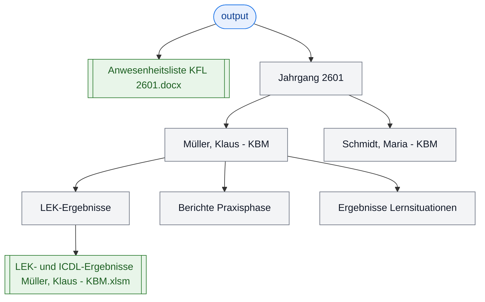

<!-- markdownlint-disable MD009 MD012 MD022 MD026 MD031 MD032 MD036 MD040 MD060 -->

# Anwenderdokumentation – TN-Doku-Konfigurator

## Überblick

**TN-Doku-Konfigurator** ist ein Windows-Tool zur automatischen Erstellung von standardisierten Teilnehmer-Ablagesystemen für neue Ausbildungsgruppen. Das Tool erstellt automatisch:

Die Teilnehmer-Ablagesysteme gelten für die kaufmännische Qualifizierung von Personen im BFW Weser-Ems.

- Ordnerstrukturen pro Teilnehmer
- Vordefinierte Unterordner-Strukturen
- Benannte Excel-Dateien pro Teilnehmer
- Eine zentrale Anwesenheitsliste im Word-Format
- Excel-Tabellenblätter mit Teilnehmernamen

**Wichtig:** Für die Verwendung muss kein Microsoft Office installiert sein – alles funktioniert vollautomatisch.

---

## Ablauf als Grafik

```mermaid
flowchart TD
   A([ZIP entpacken]) --> B[TN-Doku-Konfigurator.exe starten]
   B --> C[CSV + Ablagesystem prüfen]
   C --> D[Dokumentation erstellen]
   D --> E[Verarbeitung (5 Schritte)]
   E --> F[[Jahrgang XXXX im output]]
   E --> G[[Anwesenheitsliste KFL XXXX.docx]]

   classDef start fill:#e8f0fe,stroke:#1a73e8,color:#0b3d91;
   classDef process fill:#f3f4f6,stroke:#6b7280,color:#111827;
   classDef result fill:#e8f5e9,stroke:#2e7d32,color:#1b5e20;

   class A start;
   class B,C,D,E process;
   class F,G result;
```

---

## Installation & Start

### Schritt 1: Archiv entpacken

1. Die Datei `TN-Doku-Konfigurator_v1.2.4.zip` mit dem Windows-Explorer entpacken
2. Der entpackte Ordner enthält die Anwendung und alle nötigen Dateien

### Schritt 2: Anwendung starten

- **Windows Explorer** → Ordner öffnen → Doppelklick auf `TN-Doku-Konfigurator.exe`
- Oder: **Kommandozeile/PowerShell** → `cd Pfad/zum/Ordner` → `./TN-Doku-Konfigurator.exe`

Die GUI öffnet sich – ein Fenster mit Eingabefeldern und einem Log-Bereich.

---

## Erste Schritte

### 1. Vorlagen aktualisieren

Falls noch nicht geschehen: Den Ordner `data/Ablagesystem` mit den aktuellen Vorlagen befüllen.

**Ordnerstruktur:**
```text
data/Ablagesystem/
├── Anwesenheitsliste.docx      (Word-Vorlage für Anwesenheitsliste)
├── LEK-Ergebnisse/             (Ordner mit Excel-Musterdatei)
│   └── LEK- und ICDL-Ergebnisse Muster - KBM.xlsm
├── Berichte Praxisphase/
├── Ergebnisse Lernsituationen/
└── … (weitere Ordner nach Bedarf)
```

### 2. Teilnehmerliste vorbereiten

Die Datei `data/Teilnehmer_Beginn.CSV` muss vorliegen und mindestens folgende Spalten enthalten:

| Spaltenname | Beispiel | Beschreibung |
|-------------|----------|-------------|
| `Name` | Müller, Klaus | Nachname, Vorname |
| `Maßnahme` | KBM 2601 | Maßnahme mit Jahrgangs-Suffix |
| `Maßnahmekürzel` | KBM | Kürzel (z. B. KBM, BFK, IBA) |

**Format:**
- **Trennzeichen:** Semikolon (`;`)
- **Zeichenkodierung:** Windows-1252 (ISO-8859-1) oder UTF-8
- **Zeilenumbrüche:** Windows-Standard (CRLF)

**Beispiel `data/Teilnehmer_Beginn.CSV`:**
```csv
Name;Maßnahme;Maßnahmekürzel
Müller, Klaus;KBM 2601;KBM
Schmidt, Maria;KBM 2601;KBM
Bauer, Tim;BFK 2601;BFK
```

### 3. Anwendung nutzen

#### Schritt A: GUI starten
- `TN-Doku-Konfigurator.exe` ausführen
- Das Fenster „TN-Doku-Konfigurator" öffnet sich

#### Schritt B: Eingabefelder prüfen

Die Anwendung versucht automatisch folgende Werte zu erkennen und vorzufüllen:

- **CSV-Datei:** `data/Teilnehmer_Beginn.CSV`
- **Ausgabe-Ordner:** `output` (relativ zum Anwendungsverzeichnis / Ordner der EXE)
- **Ablagesystem-Ordner:** `data/Ablagesystem`

Die Standardwerte werden als **relative Pfade zur EXE** angezeigt.

Falls diese nicht gefunden werden oder angepasst werden sollen:
1. Auf **„Ordner …"** bzw. **„Öffnen …"** klicken
2. Datei oder Ordner auswählen

Bei manueller Auswahl übernimmt die Anwendung den Pfad als **absoluten Pfad**.

#### Schritt C: Dokumentation erstellen

1. Die Felder prüfen
2. Die CSV-Vorschau durchsehen (Tabelle mit den Teilnehmern)
3. Auf **„Dokumentation erstellen"** klicken
4. **Warten** – der Prozess läuft im Hintergrund. Im Log-Bereich wird der Fortschritt angezeigt.

#### Schritt D: Ergebnis prüfen

Nach erfolgreichem Abschluss:
- Ein neuer Ordner `Jahrgang XXXX` (z. B. `Jahrgang 2601`) ist im Ausgabe-Ordner entstanden
- Eine Datei `Anwesenheitsliste KFL 2601.docx` liegt direkt im Ausgabe-Ordner
- **Manuell in den Ordner wechseln** und die Struktur überprüfen:
- 26 Unterordner für die Teilnehmer (mit dem Muster `Name - Maßnahmekürzel`)
- In jedem Teilnehmer-Ordner: Unterordner aus `data/Ablagesystem` (z. B. `LEK-Ergebnisse`, `Berichte Praxisphase`, …)
- In `LEK-Ergebnisse`: Umbenannte Excel-Datei (z. B. `LEK- und ICDL-Ergebnisse Müller, Klaus - KBM.xlsm`)
- Im Excel: Tabellenblatt „Muster" wurde umbenannt in `Müller, Klaus`

---

## Ergebnis-Struktur

Nach erfolgreichem Ablauf entsteht folgende Struktur:

```text
<Ausgabe-Ordner>/
├── Anwesenheitsliste KFL 2601.docx
└── Jahrgang 2601/
   ├── Müller, Klaus - KBM/
   │   ├── LEK-Ergebnisse/
   │   │   └── LEK- und ICDL-Ergebnisse Müller, Klaus - KBM.xlsm
   │   ├── Berichte Praxisphase/
   │   ├── Ergebnisse Lernsituationen/
   │   └── …
   ├── Schmidt, Maria - KBM/
   │   └── (gleiche Struktur)
   └── … (weitere Teilnehmer)
```

### Struktur-Überblick als Grafik



---

## Häufige Aufgaben

### CSV-Datei in Excel vorbereiten

1. **Excel öffnen** → Neue Arbeitsmappe
2. **Spaltenköpfe eingeben:** Name | Maßnahme | Maßnahmekürzel
3. **Daten eintragen:**
   - **Name:** Nachname, Vorname (z. B. `Müller, Klaus`)
   - **Maßnahme:** Vollständiger Name mit Suffix (z. B. `KBM 2601`)
   - **Maßnahmekürzel:** Abkürzung (z. B. `KBM`)
4. **Speichern:**
   - Format: **CSV (Trennzeichen-getrennt) (.csv)**
   - **Trennzeichen:** Semikolon (`;`)
   - **Dateiname:** `data/Teilnehmer_Beginn.CSV`

### Jahrgangsordner verwalten

Standardmäßig wird der neue `Jahrgang XXXX`-Ordner im Ausgabe-Ordner erstellt.

**Um ihn ins Basisverzeichnis zu verschieben:**
- Den `Jahrgang XXXX`-Ordner **ausschneiden** (Rechtsklick → Ausschneiden)
- Im **Basisverzeichnis** (wo die EXE liegt) **einfügen** (Rechtsklick → Einfügen)

### Vorlagen aktualisieren

Falls sich die Vorlagen ändern:
1. **Word/Excel öffnen** → Vorlage bearbeiten
2. **Speichern** unter demselben Namen im Ordner `data/Ablagesystem`
3. **Anwendung neu starten** → Die neuen Vorlagen werden verwendet

---

## Fehlerbehandlung

### Log zeigt Fehler

**Fehler: CSV-Datei nicht gefunden**
- Sicherstellen, dass `data/Teilnehmer_Beginn.CSV` vorhanden ist oder via Button ausgewählt wurde
- **Dateiname-Schreibweise prüfen** (Groß-/Kleinschreibung beachten)

**Fehler: Ablagesystem-Ordner nicht gefunden**
- Den Ordner `data/Ablagesystem` im Anwendungsverzeichnis bereitstellen oder via Button auswählen
- Sicherstellen, dass die Vorlagen-Dateien darin enthalten sind

**Fehler: Maßnahme zu kurz**
- In der CSV prüfen: Die Spalte `Maßnahme` muss mindestens 4 Zeichen enthalten (z. B. `KBM 2601`)
- Die letzten 4 Zeichen werden als Jahrgangs-Suffix extrahiert

**Fehler: Zeilenumbruch im Namen**
- CSV-Datei im Text-Editor öffnen und prüfen, dass keine Zeilenumbrüche in den Namen-Feldern sind
- Ggf. Datei neu speichern

### Anwendung reagiert nicht

- **Warten:** Der Prozess kann bei vielen Teilnehmern mehrere Sekunden dauern
- Falls nach 1 Minute nichts passiert: Fenster schließen und neu starten
- Das Log-Fenster zeigt den aktuellen Fortschritt

---

## Speicherplatz & Performance

- **Typische Größe pro Teilnehmer:** 50–500 KB (abhängig von den Vorlagen)
- **Für 26 Teilnehmer:** ca. 5–10 MB
- **Verarbeitungsdauer:** ca. 5–10 Sekunden für 26 Teilnehmer

---

## Sicherheit & Datenschutz

- Die Anwendung arbeitet **lokal** auf dem Computer – keine Cloud-Uploads
- Alle Dateien werden im angegebenen Ausgabe-Ordner erstellt
- **Keine Netzwerkverbindung** erforderlich
- Die Anwendung speichert **keine Logs** außerhalb des Fensters

---

## Support & Feedback

Bei Fragen oder Problemen:
1. Diese Anleitung durchlesen (siehe Fehlerbehandlung)
2. Die Logs im Fenster überprüfen
3. Den Fehler notieren und an die Entwicklung weitergeben
