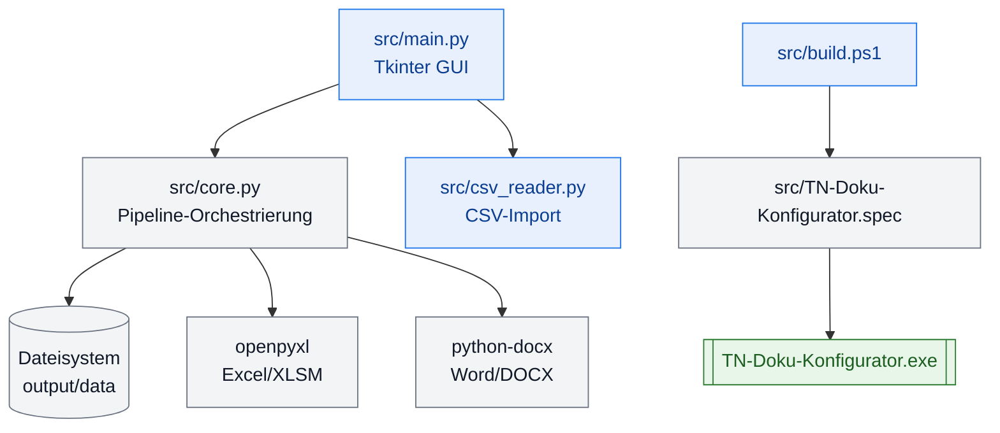

<!-- markdownlint-disable MD009 MD012 MD022 MD026 MD031 MD032 MD036 MD040 MD060 -->

# Technische Dokumentation – TN-Doku-Konfigurator

## Überblick

TN-Doku-Konfigurator ist eine eigenständige Windows-Anwendung (EXE), die mit Python 3.x, Tkinter und spezialisierten Bibliotheken für Office-Dateien gebaut wird. Die Anwendung folgt einer **5-Schritte-Pipeline** zur Teilnehmer-Verwaltung.

Die Teilnehmer-Ablagesysteme gelten für die kaufmännische Qualifizierung von Personen im BFW Weser-Ems.

---

## Architektur

### Systemübersicht (Grafik)



---

### Komponenten

| Modul | Datei | Zweck |
|-------|-------|-------|
| **GUI** | `src/main.py` | Tkinter-Oberfläche, Eingabefelder, Log-Ausgabe |
| **Core Logic** | `src/core.py` | 5-Schritte-Pipeline, Office-Dateiverarbeitung |
| **CSV-Import** | `src/csv_reader.py` | CSV-Parsing mit Encoding-Erkennung |
| **Versioning** | `src/build_info.py` | Versionsinformation, Build-Datum |
| **Build** | `src/build.ps1` | PyInstaller-Automatisierung, Version-Bump |

### Abhängigkeiten

```txt
openpyxl >= 3.1.0          # Excel-Dateien (XLSM) – read/write mit VBA-Support
python-docx >= 1.1.0       # Word-Dateien (DOCX) – read/write
pyinstaller >= 6.17.0      # EXE-Erstellung
tkinter                     # Bereits in Python enthalten
```

---

## Module

### main.py – GUI (Tkinter)

#### Klasse: `App(tk.Tk)`

Hauptfenster der Anwendung.

**Init-Parameter:**
- Keine (verwendet globale Einstellungen)

**Key Methods:**

| Methode | Beschreibung |
|---------|-------------|
| `_load_defaults()` | Versucht automatisch `Teilnehmer_Beginn.CSV` und `_Listen`-Ordner zu finden |
| `_resolve_path()` | Löst relative Eingaben relativ zum EXE-/App-Verzeichnis auf |
| `_browse_csv()` | Dateiauswahl-Dialog für CSV |
| `_browse_output()` | Verzeichnisauswahl-Dialog für Ausgabe |
| `_browse_lists()` | Verzeichnisauswahl-Dialog für Ablagesystem |
| `_start_run()` | Startet Verarbeitung in separatem Thread |
| `_run_worker()` | Worker-Thread – führt `run_all()` aus |
| `_log(msg, level)` | Schreibt in Log-Fenster |

**GUI-Elemente:**
- `Entry` für CSV-Pfad, Ausgabe-Ordner und Ablagesystem-Ordner
- `Button` für Pfadauswahl („…")
- `Treeview` für CSV-Vorschau (Name, Maßnahme, Kürzel)
- `Text` für Log-Ausgabe
- `Button` zum Starten („Dokumentation erstellen")

**Pfadverhalten (GUI):**
- Standardwerte werden als relative Pfade zur EXE angezeigt (z. B. `data/Teilnehmer_Beginn.CSV`, `output`, `data/Ablagesystem`).
- Bei manueller Auswahl über Dateidialoge werden absolute Pfade in die Eingabefelder übernommen.
- Vor der Verarbeitung werden alle Pfade über `_resolve_path()` in normalisierte absolute Pfade umgewandelt.
- Der Ausgabe-Ordner wird bei Bedarf automatisch erzeugt.

**Threading:**
- Verarbeitung läuft in `threading.Thread` – GUI bleibt responsive
- Logs werden via Queue asynchron in die GUI geschrieben

---

### core.py – Kernlogik

#### 5-Schritte-Pipeline

**1. `create_participant_folders(participants, output_dir, log=None)`**
- Liest Maßnahmen-Suffix aus erstem Teilnehmer (letzte 4 Zeichen von `Maßnahme`)
- Erstellt Ordner `Jahrgang XXXX`
- Erstellt je Teilnehmer einen Ordner `Name - Maßnahmekürzel`

**2. `copy_template_structure(lists_dir, jahrgang_path, log=None)`**
- Kopiert alle Unterordner aus `_Listen` in jeden Teilnehmer-Ordner
- Nutzt `shutil.copytree()` für rekursives Kopieren

**3. `rename_excel_files(jahrgang_path, log=None)`**
- Findet die Musterdatei `LEK- und ICDL-Ergebnisse Muster - KBM.xlsm`
- Benennt sie um zu `LEK- und ICDL-Ergebnisse {Name - Kürzel}.xlsm`
- Nutzt `openpyxl.load_workbook()` mit `keep_vba=True`

**4. `rename_excel_sheets(jahrgang_path, log=None)`**
- Findet das Tabellenblatt „Muster" in jeder XLSM
- Benennt es um zu `{Name}` (nur Nachname+Vorname, ohne Kürzel)
- Speichert mit `keep_vba=True`

**5. `create_anwesenheitsliste(participants, template_path, output_dir, log=None)`**
- Lädt Word-Vorlage (`Anwesenheitsliste.docx`)
- Setzt Kopfzeile: `Anwesenheitsliste KFL {suffix}\tDatum:`
- Entfernt leere Vorlage-Zeilen aus der Tabelle
- Fügt pro Teilnehmer eine Zeile ein: Kürzel (fett) | Name
- Berechnet Zeilenhöhen für 1-Seiten-Fit
- Speichert als `Anwesenheitsliste KFL {suffix}.docx` direkt im Ausgabe-Ordner

#### Main Function: `run_all(participants, output_dir, lists_dir, log=None)`

Orchestriert alle 5 Schritte in Reihenfolge. Gibt Pfad zum `jahrgang_path` zurück.

#### Helper Function: `get_app_dir()`

Ermittelt Basisverzeichnis:
- Im frozen EXE-Modus: `sys.executable` parent
- Im Dev-Modus: Projekt-Wurzel (eine Ebene über `src/`)

---

### csv_reader.py – CSV-Import

#### Function: `read_participants(csv_path: str) -> list[dict]`

**Algorithmus:**
1. Versucht Encoding-Erkennung in dieser Reihenfolge:
   - `windows-1252` (Standard Windows)
   - `utf-8-sig` (UTF-8 mit BOM)
   - `utf-8`
   - `latin-1`
2. Liest CSV mit `;` als Trennzeichen
3. Prüft Pflicht-Spalten: `{'Name', 'Maßnahme', 'Maßnahmekürzel'}`
4. Gibt Liste von Dicts zurück (je Zeile ein Dict)

**Exception:**
- `FileNotFoundError` – CSV nicht vorhanden
- `ValueError` – Pflicht-Spalten fehlen oder Encoding misslungen

**Rückgabe-Format:**
```python
[
    {'Name': 'Müller, Klaus', 'Maßnahme': 'KBM 2601', 'Maßnahmekürzel': 'KBM'},
    {'Name': 'Schmidt, Maria', 'Maßnahme': 'KBM 2601', 'Maßnahmekürzel': 'KBM'},
]
```

---

### build_info.py – Versionierung

```python
BUILD_INFO = {
    'version': '1.2.4',
    'build_date': '2026-09-20T00:00:00',
    'python_version': '3.13.14',
    'platform': 'win32',
}
```

Wird von `src/build.ps1` automatisch aktualisiert.

---

## Build-System

### src/build.ps1

PowerShell-Skript für vollautomatisches Build & Release.

**Funktionsweise:**
1. **Version-Bump:** Liest `src/build_info.py`, erhöht die Patch-Version (z. B. 1.2.4 → 1.2.4).
2. **Abhängigkeitsprüfung:** Verwendet bevorzugt die Projekt-`.venv` und prüft vor dem Build den Import von `python-docx`.
3. **PyInstaller:** Ruft die `.spec`-Datei auf, erstellt eine Onefile-EXE in `dist/` und bindet `python-docx` ein.
4. **Artifacts kopieren:**
    - `data/Ablagesystem/` → `dist/{folder}/data/Ablagesystem/`
    - `data/Teilnehmer_Beginn.CSV` → `dist/{folder}/data/Teilnehmer_Beginn.CSV`
   - `README.md` → `dist/{folder}/`
    - `docs/` → `dist/{folder}/docs/`
5. **Archivierung:** Verschiebt ältere Release-Artefakte nach `release/_Archiv/`.
6. **ZIP-Erstellung:** Nutzt .NET `ZipFile.CreateFromDirectory()`.
7. **Output:** `release/TN-Doku-Konfigurator_v{version}.zip` und `release/RELEASE_NOTES_v{version}.md`.

**Parameter:**

| Parameter | Effekt |
|-----------|--------|
| `-NoVersionBump` | Version nicht erhöhen (für Tests) |
| `-SkipZip` | Nur EXE, kein ZIP |
| `-Help` | Hilfe anzeigen |
| `-Quiet` | Keine Ausgabe (Script-Modus) |

**Beispiele:**
```powershell
.\src\build.ps1                    # Vollständiger Build mit Version-Bump
.\src\build.ps1 -NoVersionBump     # Nur EXE/ZIP, ohne Version-Erhöhung
.\src\build.ps1 -SkipZip           # EXE + Dateien, kein ZIP
.\src\build.ps1 -Quiet             # Im Hintergrund, für CI/CD
```

---

### src/TN-Doku-Konfigurator.spec

PyInstaller-Konfiguration.

**Key Settings:**
- `onefile`: Einzelne EXE mit integrierten Abhängigkeiten
- `name`: `TN-Doku-Konfigurator`
- `console=False`: Keine Konsole (GUI-only)
- `icon`: Logo (falls vorhanden)
- `datas`: `src/build_info.py` eingebunden
- `hiddenimports`: Module von `python-docx`, damit Word-Verarbeitung auch in der Onefile-EXE verfügbar ist

---

## Datenfluss

### Datenfluss als Grafik

```mermaid
flowchart TD
    CSVF([Teilnehmer_Beginn.CSV]) --> R[csv_reader.read_participants]
    R --> P[participants[]]
    P --> RUN[core.run_all]
    RUN --> S1[1. Ordnerstruktur]
    RUN --> S2[2. Ablagestruktur]
    RUN --> S3[3. Excel-Dateien umbenennen]
    RUN --> S4[4. Excel-Blätter umbenennen]
    RUN --> S5[5. Anwesenheitsliste erstellen]
    S1 --> OUT[[output/Jahrgang XXXX]]
    S5 --> DOC[[output/Anwesenheitsliste KFL XXXX.docx]]

    classDef source fill:#e8f0fe,stroke:#1a73e8,color:#0b3d91;
    classDef process fill:#f3f4f6,stroke:#6b7280,color:#111827;
    classDef result fill:#e8f5e9,stroke:#2e7d32,color:#1b5e20;

    class CSVF source;
    class R,P,RUN,S1,S2,S3,S4,S5 process;
    class OUT,DOC result;
```

---

```
CSV-Datei
(Teilnehmer_Beginn.CSV)
    ↓
csv_reader.py
(read_participants)
    ↓
[{Name, Maßnahme, Kürzel}, ...]
    ↓
core.py (run_all)
    ├─→ Schritt 1: Ordner anlegen
    ├─→ Schritt 2: Struktur kopieren
    ├─→ Schritt 3: Excel umbenennen
    ├─→ Schritt 4: Blätter umbenennen
    └─→ Schritt 5: Anwesenheitsliste erstellen
    ↓
output/
├── Anwesenheitsliste KFL XXXX.docx
└── Jahrgang XXXX/
    ├── Teilnehmer 1/
    └── Teilnehmer 2/
```

---

## Deployment

### Für Endbenutzer

1. `release/TN-Doku-Konfigurator_v{version}.zip` herunterladen
2. Entpacken
3. `TN-Doku-Konfigurator.exe` ausführen
4. **Kein Python, kein Setup nötig**

### Für Entwickler

1. Git-Repository klonen
2. `.\src\setup.ps1` ausführen (`.venv` + Packages installieren)
3. `.\src\build.ps1` ausführen (EXE + ZIP erstellen)
4. Dateien landen in:
    - Onefile-EXE (Build-Output): `dist/TN-Doku-Konfigurator.exe`
    - Verteilungsordner: `dist/TN-Doku-Konfigurator-v{version}/`
    - ZIP: `release/TN-Doku-Konfigurator_v{version}.zip`

### Build/Release-Pipeline (Grafik)

```mermaid
flowchart TD
    A([src/build_info.py lesen]) --> B[Version prüfen/setzen]
    B --> C[PyInstaller via spec]
    C --> D[[dist/TN-Doku-Konfigurator.exe]]
    D --> E[dist/TN-Doku-Konfigurator-v{version}]
    E --> F[docs + data + README kopieren]
    F --> G[[release/TN-Doku-Konfigurator_{version}.zip]]
    G --> H[[release/RELEASE_NOTES_v{version}.md]]

    classDef source fill:#e8f0fe,stroke:#1a73e8,color:#0b3d91;
    classDef process fill:#f3f4f6,stroke:#6b7280,color:#111827;
    classDef result fill:#e8f5e9,stroke:#2e7d32,color:#1b5e20;

    class A source;
    class B,C,E,F process;
    class D,G,H result;
```

---

## Fehlerbehandlung & Logging

### Log-Levels

Im GUI-Log-Fenster erscheinen:
- **Info (Standard):** Fortschritt (z. B. „Schritt 1/5 …", „Ordner erstellt: 26")
- **Warning:** Nicht-kritische Probleme (z. B. „Ordner bereits vorhanden")
- **Error:** Kritische Fehler (stoppt den Prozess)

### Exceptions

| Exception | Ursache | Behebung |
|-----------|--------|----------|
| `FileNotFoundError` | CSV oder _Listen nicht gefunden | Pfade prüfen, via GUI auswählen |
| `ValueError` | CSV-Spalten fehlen oder Encoding-Fehler | CSV-Format überprüfen |
| `openpyxl.utils.exceptions.InvalidFileException` | XLSM beschädigt | Vorlage neu ablegen |
| `docx.opc.exceptions.PackageNotFoundError` | DOCX beschädigt | Vorlage neu ablegen |

---

## Performance & Skalierbarkeit

- **Typische Verarbeitungsdauer:** 5–10 Sekunden für 26 Teilnehmer
- **Speicher:** ~50–100 MB RAM während Verarbeitung
- **Diskettenwächter:** Keine Beschränkung (getestet bis 100+ Teilnehmer)

---

## Bekannte Einschränkungen

1. **Windows-only:** Kein macOS/Linux-Support (Tkinter hat Plattform-Limits)
2. **VBA in Excel:** XLSM-Macros werden bewahrt, aber nicht modifiziert
3. **Word-Makros:** DOCM-Format wird nicht unterstützt (nur DOCX)
4. **Encoding:** CSV muss UTF-8 oder Windows-1252 sein

---

## Entwicklung & Änderungen

### Branch-Strategie

- **main:** Stabile Release-Version
- **develop:** Development-Branch (optional)

### Version-Schema

Semantische Versionierung: `{major}.{minor}.{patch}`
- **1.0.0 – 1.0.x:** Initiale Releases (nur Patch-Fixes)
- **1.1.0+:** Minor Features, größere Refactorings
- **2.0.0+:** Breaking Changes

### Commit-Konventionen

```
fix: Kurze Beschreibung         # Bugfix
feat: Kurze Beschreibung        # Feature
refactor: Kurze Beschreibung    # Code-Umgestaltung
docs: Kurze Beschreibung        # Dokumentation
chore: Kurze Beschreibung       # Build, Dependencies, etc.
build: Kurze Beschreibung       # Build & Release (EXE, ZIP)
```

Beispiel:
```
fix: Anwesenheitsliste – Datum-Tab korrigiert, leere Zeile entfernt, 1-Seiten-Fit
feat: CSV-Vorschau in der GUI hinzugefügt
build: EXE v3.0.6 – Onefile-Release via src/build.ps1
```

---

## Testing & Quality Assurance

### Manuelles Testing

1. **CSV-Test:** Verschiedene Encodings testen (Windows-1252, UTF-8)
2. **GUI-Test:** Pfad-Auswahl, Vorschau, Fehlerbehandlung
3. **Core-Test:** `run_all()` mit realen Daten testen
4. **Build-Test:** `src/build.ps1` mit verschiedenen Flags testen

### Automationstest

```powershell
# Syntax-Check
.\.venv\Scripts\python.exe -m py_compile src/*.py

# Unit-Test (optional)
.\.venv\Scripts\pytest tests/
```

---

## Lizenz & Attribution

Siehe `LICENSE` im Projekt-Wurzel.
