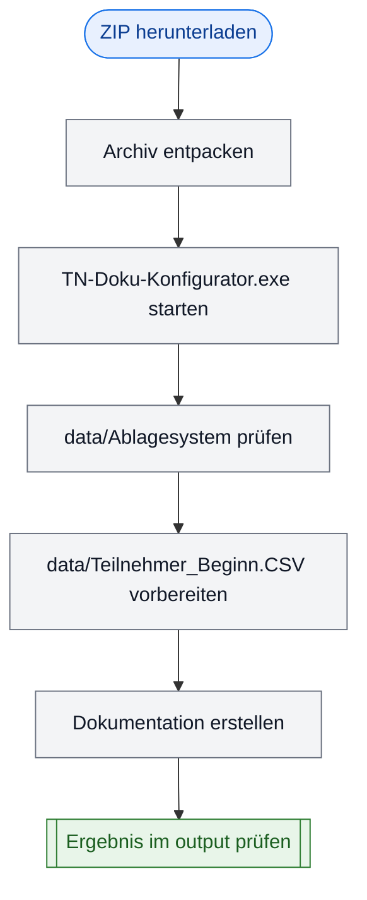

<!-- markdownlint-disable MD009 MD012 MD022 MD026 MD031 MD032 MD036 MD040 MD060 -->

# Installationsanleitung – TN-Doku-Konfigurator

Die Teilnehmer-Ablagesysteme gelten für die kaufmännische Qualifizierung von Personen im BFW Weser-Ems.

## Systemvoraussetzungen

| Anforderung | Mindestversion | Bemerkung |
|-------------|----------------|----------|
| **OS** | Windows 10 (Build 1909+) oder Windows 11 | 64-bit erforderlich |
| **RAM** | 2 GB | 4 GB empfohlen |
| **Festplatte** | 100 MB freier Speicher | Für Installation und Arbeitsdateien |
| **Office** | **Nicht erforderlich** | Excel/Word müssen nicht installiert sein |
| **Python** | **Nicht erforderlich** | Alles ist in der EXE enthalten |

---

## Installation für Endbenutzer

### Installationsablauf als Grafik



### Option 1: Portable EXE (empfohlen)

**Schritt 1: Archiv herunterladen**
- Die Datei `TN-Doku-Konfigurator_v1.2.4.zip` herunterladen

**Schritt 2: Entpacken**
1. **Rechtsklick** auf die ZIP-Datei
2. **„Alle extrahieren" oder „Extract All"** auswählen
3. Einen neuen, leeren Zielordner auswählen

**Schritt 3: Starten**
1. Den entpackten Ordner öffnen
2. **Doppelklick** auf `TN-Doku-Konfigurator.exe`
3. Das Fenster öffnet sich – fertig!

**Wichtig:**
- Keine zusätzliche Installation nötig
- Die EXE kann überall auf dem Computer abgelegt werden
- Auf USB-Stick kopierbar – läuft überall

---

### Option 2: Von GitHub klonen (für Entwickler)

```powershell
# Repository klonen
git clone https://github.com/GoroTech-Tools/TN-Doku-Konfigurator.git
cd TN-Doku-Konfigurator

# Virtuelle Umgebung und Packages installieren
.\src\setup.ps1

# Anwendung starten (Entwicklungsmodus)
.\.venv\Scripts\python.exe src/main.py

# EXE bauen
.\src\build.ps1
```

Danach liegt die EXE in: `dist/TN-Doku-Konfigurator-v{version}/TN-Doku-Konfigurator.exe`

---

## Vorbereitung der Daten

### 1. Ablagesystem-Ordner vorbereiten

Der Ordner `data/Ablagesystem` muss folgende Dateien/Ordner enthalten:

```text
data/Ablagesystem/
├── Anwesenheitsliste.docx              (ERFORDERLICH)
├── LEK-Ergebnisse/
│   └── LEK- und ICDL-Ergebnisse Muster - KBM.xlsm  (ERFORDERLICH)
├── Berichte Praxisphase/               (optional)
├── Ergebnisse Lernsituationen/         (optional)
├── Profilingbögen/                     (optional)
├── Themenlisten/                       (optional)
├── Zertifikate, Zeugnisse/             (optional)
└── …weitere Ordner…                    (optional)
```

**Anleitung:**
1. Im entpackten Ordner auf den Ordner `data/Ablagesystem` prüfen
2. Falls nicht vorhanden: Ordner `data/Ablagesystem` manuell erstellen
3. Erforderliche Dateien einfügen (siehe oben)
4. Optionale Ordner nach Bedarf hinzufügen

### 2. Teilnehmerliste vorbereiten

**Dateiname:** `data/Teilnehmer_Beginn.CSV`
**Format:** Semikolon-getrennt (CSV)
**Trennzeichen:** `;` (Semikolon)
**Zeichenkodierung:** Windows-1252 oder UTF-8
**Spalten:**

| Spaltenname | Erforderlich | Beispiel |
|-------------|-------------|----------|
| Name | Ja | Müller, Klaus |
| Maßnahme | Ja | KBM 2601 |
| Maßnahmekürzel | Ja | KBM |
| *(weitere)* | Nein | Beliebig |

**Schrittweise Erstellung:**

#### Mit Excel:
1. **Excel öffnen** → Neue Arbeitsmappe
2. **Spaltenköpfe eintragen (Zeile 1):**
   ```
   Name;Maßnahme;Maßnahmekürzel
   ```
3. **Daten eintragen (ab Zeile 2):**
   ```
   Müller, Klaus;KBM 2601;KBM
   Schmidt, Maria;KBM 2601;KBM
   Bauer, Tim;BFK 2601;BFK
   …
   ```
4. **Speichern:**
   - **Dateiname:** `Teilnehmer_Beginn.CSV`
   - **Format:** Wähle **„CSV (Trennzeichen-getrennt) (.csv)"**
   - Wenn Excel fragt „CSV-Format speichern?" → **Ja**
   - **Trennzeichen:** Semikolon (`;`) – **wichtig!**

#### Mit Texteditor:
1. **Notepad** (oder beliebiger Texteditor) öffnen
2. **Folgende Struktur eintragen:**
   ```
   Name;Maßnahme;Maßnahmekürzel
   Müller, Klaus;KBM 2601;KBM
   Schmidt, Maria;KBM 2601;KBM
   Bauer, Tim;BFK 2601;BFK
   ```
3. **Speichern unter:**
   - **Dateiname:** `Teilnehmer_Beginn.CSV`
   - **Kodierung:** UTF-8 oder Windows-1252
4. **In den Ordner `data/` legen**

### 3. Ausgabe-Ordner vorbereiten

Der Ausgabe-Ordner wird automatisch erkannt oder kann manuell ausgewählt werden.

**Automatische Erkennung:**
- Die Anwendung verwendet standardmäßig das Anwendungsverzeichnis (Ordner der EXE)
- Alternativ kann ein beliebiger Ausgabe-Ordner manuell gewählt werden

**Manuell:**
1. Einen neuen Ordner erstellen (z. B. `Jahrgänge`)
2. Im GUI-Fenster auf **„…"** (neben „Ausgabe-Ordner") klicken
3. Den Ordner auswählen

---

## Erste Verwendung

### Schritt 1: EXE starten

```
cd C:\Pfad\zum\TN-Doku-Konfigurator
TN-Doku-Konfigurator.exe
```

Das GUI-Fenster öffnet sich.

### Schritt 2: Felder prüfen & ggf. korrigieren

| Feld | Automatische Erkennung | Manuell anpassen |
|------|----------------------|------------------|
| **CSV-Datei** | `data/Teilnehmer_Beginn.CSV` (im Anwendungsverzeichnis) | Button „…" klicken |
| **Ausgabe-Ordner** | Anwendungsverzeichnis (Ordner der EXE) | Button „…" klicken |
| **Ablagesystem-Ordner** | `data/Ablagesystem` (im Anwendungsverzeichnis) | Button „…" klicken |

### Schritt 3: CSV-Vorschau überprüfen

Im GUI-Fenster werden die Teilnehmer in einer Tabelle angezeigt:
- **Spalte 1:** Name
- **Spalte 2:** Maßnahme
- **Spalte 3:** Maßnahmekürzel

Falls die Tabelle **leer** oder **fehlerhaft** ist → CSV-Datei nochmal überprüfen

### Schritt 4: Dokumentation erstellen

1. Button **„Dokumentation erstellen"** klicken
2. **Warten** – Das Log-Fenster zeigt den Fortschritt
3. Nach erfolgreicher Fertigstellung: Ein neuer Ordner `Jahrgang XXXX` ist entstanden

### Schritt 5: Ergebnis überprüfen

1. Im **Windows-Explorer** zum Ausgabe-Ordner gehen
2. Den neuen Ordner `Jahrgang 2601` (oder ähnlich) öffnen
3. Prüfen:
   - ✅ **26 Teilnehmer-Ordner** mit Namen (z. B. `Müller, Klaus - KBM`)
   - ✅ **In jedem Ordner:** Unterordner aus `data/Ablagesystem` (z. B. `LEK-Ergebnisse`)
   - ✅ **In `LEK-Ergebnisse`:** Umbenannte Excel-Datei (z. B. `LEK- und ICDL-Ergebnisse Müller, Klaus - KBM.xlsm`)
   - ✅ **Datei `Anwesenheitsliste KFL 2601.docx`** im Jahrgangsordner

Falls alles OK → **Fertig!**

---

## Troubleshooting

### Anwendung startet nicht

**Problem:** EXE stellt sich hin oder zeigt einen Fehler

**Lösungen:**
1. **Windows-Sicherheit deaktiviert?**
   - Antivirus/Windows Defender könnte die EXE blockieren
   - Lösung: In den Sicherheitseinstellungen die EXE freigeben
2. **Falsche Architektur?**
   - 32-bit EXE auf 64-bit Windows?
   - Lösung: 64-bit EXE herunterladen
3. **System-Dateien beschädigt?**
   - Lösung: Windows Update durchführen

### CSV-Datei wird nicht erkannt

**Problem:** Im GUI wird die CSV nicht angezeigt oder zeigt Fehler

**Lösungen:**
1. **Dateiname prüfen:**
   - Muss exakt `Teilnehmer_Beginn.CSV` heißen (Groß-/Kleinschreibung!)
   - Standardpfad ist `data/Teilnehmer_Beginn.CSV`
2. **Format prüfen:**
   - Öffne die CSV im Texteditor (Notepad)
   - Spalten müssen mit `;` getrennt sein
   - Kopfzeile muss `Name;Maßnahme;Maßnahmekürzel` sein
3. **Encoding prüfen:**
   - Speichern Sie die CSV nochmal in Windows-1252 oder UTF-8 (nicht ANSI)
4. **Manuell auswählen:**
   - Button „…" klicken und die Datei manuell auswählen

### Ablagesystem-Ordner nicht gefunden

**Problem:** Das Tool sagt, dass der Ablagesystem-Ordner nicht vorhanden ist

**Lösungen:**
1. **Ordner prüfen:**
   - Im Windows-Explorer: Ist der Ordner `data/Ablagesystem` im gleichen Verzeichnis wie die EXE?
2. **Ordner erstellen:**
   - Falls nicht vorhanden: Neuen Ordner `data/Ablagesystem` erstellen
   - Erforderliche Dateien einfügen:
     - `Anwesenheitsliste.docx`
     - `LEK-Ergebnisse/` (mit Excel-Musterdatei)
3. **Manuell auswählen:**
   - Button „…" klicken und den Ordner manuell auswählen

### Verarbeitung stecken bleibt / wird nicht fertig

**Problem:** Das Tool läuft, aber der Log aktualisiert sich nicht mehr

**Lösungen:**
1. **Warten:** Große Listen (50+ Teilnehmer) können länger dauern
2. **Neu starten:** Fenster schließen (Rechtsklick → Schließen) und die EXE erneut starten
3. **Logs überprüfen:** Im Log-Fenster sind Fehler sichtbar?

---

## Deinstallation

Die Anwendung ist **portabel** – keine echte Installation nötig!

**Zum Löschen:**
- Den entpackten Anwendungsordner einfach **löschen**
- Keine Dateien in Windows-Registrierung oder `AppData` vorhanden
- Fertig!

---

## Nächste Schritte

Nach erfolgreicher Installation:

1. **Dokumentation lesen:** [DOKUMENTATION_ANWENDER.md](DOKUMENTATION_ANWENDER.md)
2. **Technische Details:** [DOKUMENTATION_TECHNIK.md](DOKUMENTATION_TECHNIK.md) (für Entwickler)
3. **Häufige Fragen:** [FAQ.md](FAQ.md)
